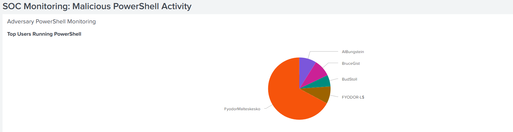

#  SOC Monitoring: Malicious PowerShell Activity
**Lab Environment:** Splunk Enterprise (Home Lab) | **Dataset:** BOTSv3 (Frothly)

## Project Objective
The goal of this project was to identify and visualize **Living off the Land (LotL)** techniques used by adversaries. Specifically, I focused on detecting unauthorized PowerShell execution (MITRE ATT&CK T1059.001) where scripts were obfuscated or security policies were bypassed.

## Investigation Workflow
1. **Data Normalization:** Ingested raw XML-formatted Sysmon logs and utilized the `xmlkv` command to extract hidden fields.
2. **Threat Hunting:** Authored SPL queries to filter for `-enc` (Encoded) and `Bypass` flags within the `CommandLine` data.
3. **User Behavior Analytics:** Created a visualization to identify outliers in PowerShell usage across the organization.

## Dashboard Preview

## Tools & Skills
* **Splunk SPL:** `xmlkv`, `stats`, `rex`, `eval`.
* **Telemetry:** Windows Sysmon (EventID 1).
* **Frameworks:** MITRE ATT&CK Mapping.
