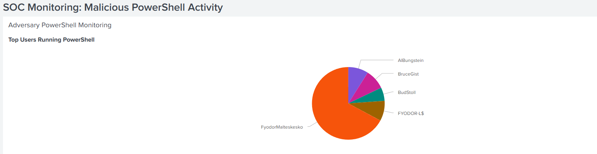

#  Splunk Threat Hunting: Malicious PowerShell Detection
**Platform:** Splunk Enterprise (Home Lab)
**Dataset:** Boss of the SOC v3 (Frothly brewery scenario)
**Technique Detected:** MITRE ATT&CK T1059.001 — Command and Scripting Interpreter: PowerShell
**Log Source:** Windows Sysmon EventID 1 (Process Create)

## Project Objective
The goal of this project was to identify and visualize Living off the Land (LotL) techniques 
used by adversaries. Specifically, I focused on detecting unauthorized PowerShell execution 
(MITRE ATT&CK T1059.001) where scripts were obfuscated or security policies were bypassed.
Attackers frequently abuse PowerShell with -EncodedCommand and -ExecutionPolicy Bypass flags 
to evade defenses — this lab hunts for exactly those patterns in real-world breach data.

## Investigation Workflow

### Step 1 — Baseline: Who Is Running PowerShell?
Started by identifying all accounts executing powershell.exe across the environment
to establish a baseline and surface outliers. Used `xmlkv` to parse the raw Sysmon
XML and extract the `user` field, then aggregated by user to compare execution frequency.

**Result:** 5 accounts identified — FyodorMalteskesko dominated execution count
compared to peers, making it the highest-priority account for follow-up investigation.

See: [`queries/01_baseline_powershell_users.spl`](queries/01_baseline_powershell_users.spl)

---

### Step 2 — Encoded Command Detection
Filtered for PowerShell command lines containing `-enc` (Base64-encoded payload flag)
combined with `-NoP -NonI -W Hidden` — flags that suppress user interaction and hide
the PowerShell window entirely, indicating deliberate evasion of detection.

Used `rex` to extract the `CommandLine` field directly from the raw Sysmon XML blob,
then searched for any command containing `*powershell*`.

**Result:** 16 events across 11 distinct command lines, all containing encoded payloads
with hidden window flags. One entry showed `schtasks.exe` creating a scheduled task
pointing back to `powershell.exe`, indicating the attacker was establishing persistence.

See: [`queries/02_detect_encoded_powershell.spl`](queries/02_detect_encoded_powershell.spl)

---

### Step 3 — Parent/Child Process Tree Analysis
Mapped every parent-child process relationship in the dataset to identify abnormal
process spawning chains. Used two `rex` extractions to pull both `Image` (child) and
`ParentImage` (parent) from Sysmon EventID 1 records, then aggregated by pair.

Suspicious chains flagged:
- `cmd.exe → WMIC.exe` — 476 occurrences (WMI-based lateral movement, MITRE T1047)
- `cmd.exe → reg.exe` — 461 occurrences (registry manipulation for persistence, MITRE T1112)

**Result:** 9,212 process creation events analyzed across 176 unique parent-child
relationships. The volume and consistency of `cmd.exe` spawning LOLBins confirmed
this was scripted attacker activity, not normal user behavior.

See: [`queries/03_parent_child_process_tree.spl`](queries/03_parent_child_process_tree.spl)

## Dashboard Preview

*Dashboard shows encoded command executions by user, parent process tree, and execution 
timeline. The XML file to import this dashboard is at `soc_powershell_monitoring.xml`.*

## Skills Demonstrated

| Skill | Detail |
|---|---|
| Splunk SPL | `xmlkv`, `stats`, `rex`, `eval`, `where`, `timechart` |
| Log Analysis | Windows Sysmon EventID 1 (Process Create) |
| Threat Hunting | LotL technique detection, obfuscation identification |
| MITRE ATT&CK | T1059.001 mapping and documentation |
| Dashboard Building | Splunk XML dashboard import/export |

## How to Reproduce

1. Download the [BOTSv3 dataset](https://github.com/splunk/botsv3) and ingest into Splunk Enterprise.
2. Ensure the `sysmon` sourcetype is configured or set manually on import.
3. Run queries in the `queries/` folder in order (01 → 03).
4. To import the dashboard: Splunk UI → Dashboards → Import → paste `soc_powershell_monitoring.xml`.

**Note:** All queries assume the index is `botsv3`. Change `index=botsv3` to your index name if different.

## Key Findings

- **5 accounts** identified running PowerShell across the environment — FyodorMalteskesko
  accounted for the dominant share of executions compared to all other accounts combined.
- **16 encoded PowerShell events** detected across **11 distinct command lines**, every one
  using `-NoP -NonI -W Hidden -enc` flags — confirming deliberate evasion, not accidental execution.
- Attacker established **persistence via scheduled task** — `schtasks.exe` was observed
  creating a task pointing back to `powershell.exe` with encoded payload arguments.
- **9,212 process creation events** analyzed — top suspicious chains were `cmd.exe → WMIC.exe`
  (476 occurrences) and `cmd.exe → reg.exe` (461 occurrences), both classic Living off the
  Land techniques consistent with scripted attacker activity.
- All findings map to Sysmon **EventID 1** (Process Create) from the BOTSv3 dataset.
